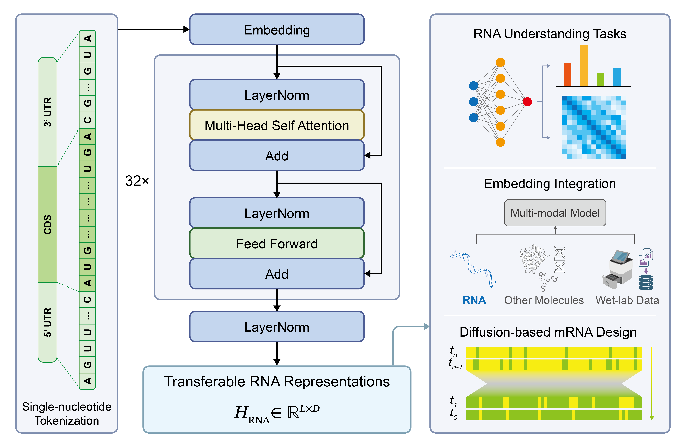
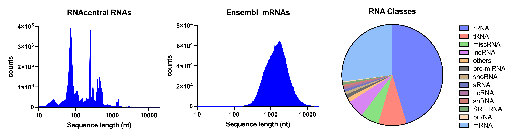

# RIBOSPAN: A Long-Context RNA Foundation Model for Versatile RNA Modeling

[](https://arxiv.org/abs/2608.22849)
[](https://github.com/GAIR-NLP/RIBOSPAN-FM)
[](https://huggingface.co/SII-GAIR-NLP/RIBOSPAN-FM)
[](LICENSE)
[](models/LICENSE)

Many full-length RNAs, particularly mRNAs, exceed the ~1K context lengths used to pretrain representative dense RNA encoders, forcing long transcripts to be truncated and preventing their 5′ UTR, CDS, and 3′ UTR from being modeled jointly at single-nucleotide resolution. **RiboSpan** is a **1.61B-parameter bidirectional Transformer** with **single-nucleotide tokenization**, **dense self-attention in every layer**, and **native long-context pretraining at up to 10,240 nt**. It is trained on **67.6 million RNA sequences comprising 85.7 billion nucleotides** from RNAcentral, Ensembl, and Ensembl Genomes.

## ✨ Features

- **🧬 Single-nucleotide Resolution**: Each nucleotide occupies **one token position**, preserving high-resolution and position-aligned representations across complete RNA sequences.

- **🧠 Dense Bidirectional Transformer**: Every layer uses **all-to-all self-attention**, allowing each nucleotide to directly access upstream, downstream, and distal sequence context.

- **📏 Native 10K Pretraining**: The long-context RiboSpan models are **natively pretrained at 10,240 nt**, learning transcript-scale context during pretraining rather than relying on inference-time context extension.

- **🧩 Robust High-Masking Representations**: Continued pretraining with **40% masking** substantially improves reconstruction under heavy corruption while **preserving backbone representation quality** established during 15% MLM pretraining.

- **🏆 SOTA Frozen Representations**: Without task-specific heads or fine-tuning, RiboSpan-10K achieves **state-of-the-art frozen RNA representation quality** among the evaluated models, with particularly strong performance on **long RNAs**.

- **🏆 Strongest RNA Encoder Foundation Model**: RiboSpan has the **strongest RNA understanding capability** among RNA encoder foundation models, covering property prediction, functional annotation, and mutation-effect scoring.



## 🚀 Quick Start

### Installation

```bash
git clone https://github.com/GAIR-NLP/RIBOSPAN-FM.git
cd RIBOSPAN-FM
pip install -e .
```

### Pretrained Weights

Pretrained RIBOSPAN checkpoints are distributed through Hugging Face.

Public checkpoints can be loaded directly from Hugging Face by specifying the model repository:

```python
ckpt = "SII-GAIR-NLP/RIBOSPAN-10K-15"
```

`from_pretrained()` automatically downloads the checkpoint and caches it locally, so no manual model-weight placement is required. Alternatively, a checkpoint can be downloaded manually to a user-specified local directory and loaded from that path:

```python
ckpt = "path/to/RIBOSPAN-10K-15"
```

For restricted-access checkpoints, **request access** through the corresponding Hugging Face model page. Once access is approved, the checkpoint can be loaded using an authenticated Hugging Face account.

### Extracting Nucleotide Representations

RiboSpan accepts standard RNA sequences directly. Input sequences are automatically uppercased, `U` is normalized to `T`, and `[CLS]` / `[SEP]` boundary tokens are added by the tokenizer. A list of sequences can be passed for batch encoding; shorter sequences are padded automatically, with `attention_mask` indicating valid token positions.

```python
from pathlib import Path
import torch
import ribospan
from ribospan import RiboSpanForMaskedLM, RiboSpanTokenizer

ckpt = "path/to/RIBOSPAN-10K-15"

device = "cuda" if torch.cuda.is_available() else "cpu"
tokenizer = RiboSpanTokenizer(str(Path(ribospan.__file__).with_name("vocab.txt")))
model = RiboSpanForMaskedLM.from_pretrained(ckpt).eval().to(device)

sequences = ["GUCUACGGCCAUACCACCCUGAACGCGCCCGAUCUCGUCUGAUCUCGGAAGCUAAGCAGGGUCGGGCCUGGUUAGUACUUGGAUGGGAGACCGCCUGGGAAUACCGGGUGCUGUAGGCUUU", "AGCAGAGUGGCGCAGCGGAAGCGUGCUGGGCCCAUAACCCAGAGGUCGAUGGAUCGAAACCAUCCUCUGCUACCA"]
batch = tokenizer(sequences, return_tensors="pt", padding=True).to(device)

with torch.inference_mode():
    hidden = model.ribospan(**batch).last_hidden_state

# Keep only nucleotide representations, excluding [CLS], [SEP], and padding.
lengths = batch["attention_mask"].sum(dim=1).tolist()
hidden_states = [hidden[i, 1:length - 1] for i, length in enumerate(lengths)]

for seq, hidden_state in zip(sequences, hidden_states):
    print(seq, tuple(hidden_state.shape))
    print(hidden_state)
```

Each tensor has shape `(sequence_length, hidden_size)` and contains the final-layer contextualized representation of one RNA sequence, with **one vector per nucleotide**.

### Masked Nucleotide Prediction

`RiboSpanForMaskedLM` can be used directly to predict masked nucleotides. Positions are **0-based nucleotide indices in the original RNA sequence**. Each sequence may mask one or more sites in the same forward pass.

```python
sequences = ["GUCUACGGCCAUACCACCCUGAACGCGCCCGAUCUCGUCUGAUCUCGGAAGCUAAGCAGGGUCGGGCCUGGUUAGUACUUGGAUGGGAGACCGCCUGGGAAUACCGGGUGCUGUAGGCUUU", "AGCAGAGUGGCGCAGCGGAAGCGUGCUGGGCCCAUAACCCAGAGGUCGAUGGAUCGAAACCAUCCUCUGCUACCA"]

# 0-based nucleotide indices in the original RNA sequences
nucleotide_positions = [
    torch.tensor([97, 113], device=device),
    torch.tensor([37, 71], device=device),
]

batch = tokenizer(sequences, return_tensors="pt", padding=True).to(device)

original_ids = []
token_positions_all = []
for i, positions in enumerate(nucleotide_positions):
    token_positions = positions + 1  # account for [CLS]
    token_positions_all.append(token_positions)
    original_ids.append(batch["input_ids"][i, token_positions].clone())
    batch["input_ids"][i, token_positions] = tokenizer.mask_token_id

with torch.inference_mode():
    logits = model(**batch).logits

for i in range(len(sequences)):
    pred_ids = logits[i, token_positions_all[i]].argmax(dim=-1)
    for j in range(len(nucleotide_positions[i])):
        original = tokenizer.id_to_token(original_ids[i][j].item())
        predicted = tokenizer.id_to_token(pred_ids[j].item())
        print(f"Sequence {i}: position={nucleotide_positions[i][j].item()}, "
              f"original={original}, predicted={predicted}")
```

### Variant Scoring

The MLM head can also be used for **zero-shot scoring of nucleotide substitutions**. For each candidate variant, the target position is masked and the model compares the likelihood assigned to the reference and alternative nucleotides under the same sequence context.

```python
sequences = ["GUCUACGGCCAUACCACCCUGAACGCGCCCGAUCUCGUCUGAUCUCGGAAGCUAAGCAGGGUCGGGCCUGGUUAGUACUUGGAUGGGAGACCGCCUGGGAAUACCGGGUGCUGUAGGCUUU", "AGCAGAGUGGCGCAGCGGAAGCGUGCUGGGCCCAUAACCCAGAGGUCGAUGGAUCGAAACCAUCCUCUGCUACCA"]

# 0-based nucleotide indices in the original RNA sequences
variant_positions = torch.tensor([97, 71], device=device)
alt_nucleotides = ["G", "C"]

batch = tokenizer(sequences, return_tensors="pt", padding=True).to(device)
batch_indices = torch.arange(len(sequences), device=device)
token_positions = variant_positions + 1

ref_ids = batch["input_ids"][batch_indices, token_positions].clone()
batch["input_ids"][batch_indices, token_positions] = tokenizer.mask_token_id

with torch.inference_mode():
    logits = model(**batch).logits[batch_indices, token_positions]

log_probs = torch.log_softmax(logits, dim=-1)

alt_nucleotides = [x.upper().replace("U", "T") for x in alt_nucleotides]
alt_ids = torch.tensor([tokenizer.token_to_id(x) for x in alt_nucleotides], device=device)

ref_scores = log_probs[batch_indices, ref_ids]
alt_scores = log_probs[batch_indices, alt_ids]
delta_scores = alt_scores - ref_scores

for i in range(len(sequences)):
    ref = tokenizer.id_to_token(ref_ids[i].item())
    alt = tokenizer.id_to_token(alt_ids[i].item())
    print(f"Sequence {i}: position={variant_positions[i].item()}, "
          f"{ref}>{alt}, delta={delta_scores[i].item():.4f}")
```

`delta > 0` prefers the alternative nucleotide; `delta < 0` prefers the reference.

## 🏗️ Model and Checkpoints

RiboSpan uses a **32-layer pre-norm bidirectional Transformer encoder** with dense multi-head self-attention and SwiGLU feed-forward networks.

| Setting | Configuration | Setting | Configuration |
|---|---|---|---|
| Transformer Layers | 32 | Model Dimension | 2,048 |
| FFN Intermediate Size | 5,440 | Attention Heads | 32 |
| Activation | SwiGLU | Normalization | LayerNorm |
| Position Encoding | RoPE (rotary dim = 64) | Head Dimension | 64 |
| Vocabulary Size | 16 | Token Unit | nucleotide |
| Maximum Native Context | 10,240 tokens | Parameters | 1.61B |

The RIBOSPAN model family currently consists of four matched checkpoints:

| Checkpoint | Native Context | Masking | Availability |
|---|---:|---:|---|
| **RIBOSPAN-1K-15** | 1,024 | 15% | ✅ [Public](https://huggingface.co/SII-GAIR-NLP/RIBOSPAN-1K-15) |
| **RIBOSPAN-1K-40** | 1,024 | 40% | ✅ [Public](https://huggingface.co/SII-GAIR-NLP/RIBOSPAN-1K-40) |
| **RIBOSPAN-10K-15** | 10,240 | 15% | 📝 [Access upon Request](https://huggingface.co/SII-GAIR-NLP/RIBOSPAN-10K-15) |
| **RIBOSPAN-10K-40** | 10,240 | 40% | ⏳ Coming Soon |

The 40% checkpoints continue from the corresponding 15% runs, **improving reconstruction robustness under heavy corruption while preserving backbone representation quality**.

## 🧬 Pretraining

The RiboSpan pretraining corpus combines diverse RNA sequences from **RNAcentral v26.0** with quality-controlled protein-coding transcripts from **Ensembl release 115** and **Ensembl Genomes release 62**. Ensembl-derived transcripts retain complete CDS and UTR annotations, providing full-transcript examples for learning dependencies across coding and untranslated regions.

After source-specific filtering, sequence normalization, and exact deduplication, the final corpus contains **67.6 million RNA sequences** comprising **85.7 billion nucleotide tokens**.

The long-context models are pretrained with masked language modeling at a **native context length of 10,240 nt**. Training begins with **15% masking** and is subsequently continued under **40% masking**. Matched 1K models use the same corpus and backbone architecture with a native context length of 1,024 nt.



## 📊 Evaluation

We evaluate RiboSpan from four complementary perspectives: **nucleotide reconstruction**, **controlled long-context representation behavior**, **frozen RNA-type representation quality**, and **downstream biological prediction**.

### 🧩 Long-Context Reconstruction

Native 10K RiboSpan models maintain **strong nucleotide reconstruction at 10,240 nt**, whereas short-context models degrade substantially when extrapolated far beyond their pretrained context. Continued pretraining with **40% masking further improves reconstruction under heavy corruption** while remaining closely matched to the 15% checkpoint under standard masking.

### 🔭 Long-Context Representation

We introduce a **controlled long-context representation benchmark** using complete mRNAs spanning **1,024 to 10,240 nt**. A short central interval is rearranged while preserving its nucleotide composition, allowing **contextual responsiveness**, **region-specific differentiation**, and the **propagation of representation changes** to be evaluated jointly.

Native 10K RiboSpan exhibits a distinct long-context representation profile. Compared with short-context dense encoders extrapolated beyond their pretrained range, it preserves **substantially stronger contextual organization at transcript-scale lengths**. Compared with long-sequence models based on hybrid sequence-mixing architectures, it shows **stronger context-dependent differentiation** while maintaining **highly controlled distal propagation**.

Together, these results show that native long-context pretraining enables dense bidirectional attention to combine **interaction flexibility with long-range calibration**, supporting **strong context-dependent reorganization** while suppressing broad, non-selective propagation across the transcript.


See [`Long_Context_Representation_Benchmark/README.md`](ribospan_benchmarks/benchmark_projects/Long_Context_Representation_Benchmark/README.md) for benchmark details.

### 🗺️ Frozen RNA Type Representation

Final-layer hidden states are mean-pooled into sequence representations and evaluated directly using **leave-one-out cosine 10-NN label recovery** and **neighborhood purity**, with **no classifier, projection head, or downstream fine-tuning**.

RiboSpan-10K achieves **state-of-the-art frozen RNA representation quality** among the evaluated foundation models, including the strongest **Overall Biotype** and **Long RNA** results. Its advantage is particularly clear for **RNAs longer than 1,024 nt**, where native long-context modeling preserves substantially more complete sequence information. The 15% and 40% 10K checkpoints remain closely matched, showing that **high-masking continued pretraining preserves the learned representation structure**.


See [`RNA_Type_Representation_Benchmark/README.md`](ribospan_benchmarks/benchmark_projects/RNA_Type_Representation_Benchmark/README.md) for benchmark details.

### 🧬 Downstream Biological Benchmarks

We evaluate frozen RiboSpan representations on two systematic biological benchmarks of downstream RNA tasks, covering **full-transcript property prediction** and **zero-shot fitness scoring**.

Frozen last-layer mean-pooled representations are evaluated with **linear probes** on **mRNABench**, covering half-life, mean ribosome load, eCLIP binding, GO, variant effect, and translation efficiency. Separately, the pretrained MLM head is used for **zero-shot masked-marginal scoring** on **RNAGym** fitness assays, with **no probe and no fine-tuning**.

On full-transcript property prediction, **RiboSpan-10K-15 is the strongest overall** among the evaluated models, and RiboSpan-10K-40 remains closely matched.

On zero-shot fitness scoring, **all RiboSpan checkpoints outperform** the other evaluated foundation models. The **1K-40 checkpoint is strongest in aggregate**, showing that local substitution likelihoods benefit from short-context, high-masking MLM, whereas **native 10K pretraining is more decisive for full-transcript prediction**.


Each axis is independently scaled to the best of the six models shown; unnormalized scores are reported in the paper.

See [`mRNABench_Linear_Probe_Benchmark/README.md`](ribospan_benchmarks/benchmark_projects/mRNABench_Linear_Probe_Benchmark/README.md) and [`RNAGym_Fitness_Benchmark/README.md`](ribospan_benchmarks/benchmark_projects/RNAGym_Fitness_Benchmark/README.md) for benchmark details.

### 🔁 Reproducing the Benchmarks

For end-to-end reproduction of the **Long-Context Representation**, **RNA-Type Representation**, **mRNABench**, and **RNAGym** evaluations, including environment setup, required checkpoints, and evaluation scripts, see [`ribospan_benchmarks/README.md`](ribospan_benchmarks/README.md).

## 📄 License

The source code in this repository is licensed under the [Apache License 2.0](LICENSE). The model weights are provided for **non-commercial research use** under the [RIBOSPAN Non-Commercial Model License 1.0](models/LICENSE).

## 🙏 Acknowledgements

We thank [RNAcentral](https://rnacentral.org/), [Ensembl](https://www.ensembl.org/), and [Ensembl Genomes](https://ensemblgenomes.org/) for providing the sequence resources used to construct the RiboSpan pretraining corpus.

We also acknowledge [Megatron-LM](https://github.com/NVIDIA/Megatron-LM) and [Hugging Face Transformers](https://github.com/huggingface/transformers), whose open-source infrastructure supported the development and implementation of RiboSpan.

## 📖 Citation

If you find RiboSpan useful in your research, please cite:

```bibtex
@misc{wang2026ribospan,
  title         = {{RIBOSPAN}: A Long-Context {RNA} Foundation Model for Versatile {RNA} Modeling},
  author        = {Wang, Ziyuan and Tang, Bohao and Zhang, Fei and Han, Shuo and Liu, Pengfei},
  year          = {2026},
  eprint        = {2608.22849},
  archivePrefix = {arXiv},
  primaryClass  = {cs.LG}
}
```

## 🤝 Contributing

Contributions are welcome! Please feel free to submit a Pull Request.

## 📞 Contact

For questions and issues, please open an issue on GitHub or contact the RIBOSPAN Team through [Generative Artificial Intelligence Research Lab, SII](https://plms.ai/) and [Shuo Han Lab, CEMCS](https://hanshuolab.sibcb.ac.cn/).

---

**RiboSpan** — Single-nucleotide Pretraining Across Native-context.